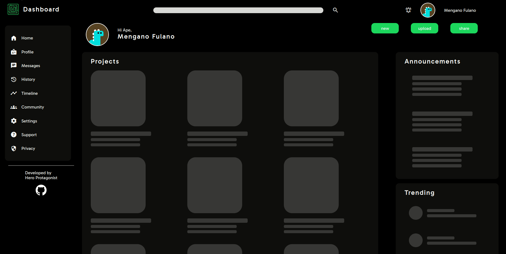

 
<h1>Admin Dashboard</h1>
<h2><em>Primates Primates Primates</em></h2>

 

## Features

- Responsive
- Skeletons that are independent from each other, content is displayed secuentialy
- Custom Monkey related Lorem Ipsum
- New text and imgs each load
- Primates

## Showcase 

Proyect assignment from [The Odin Proyect](https://www.theodinproject.com/lessons/node-path-intermediate-html-and-css-admin-dashboard)

## License
Copyright (c) 2023 carafelix  
Licensed under the MIT license.
